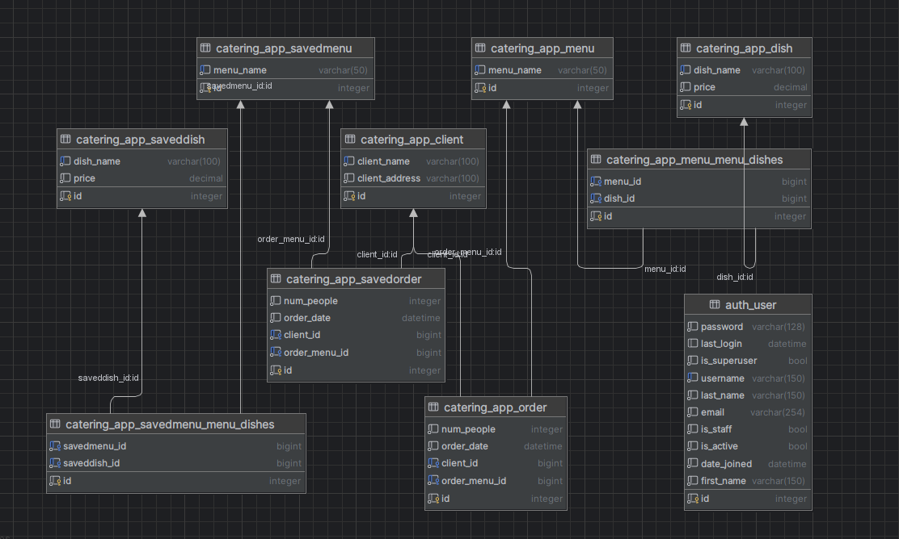

# CateringDBSystem

Django project for managing clients and dishes in Catering

## Check it out!

[Catering project deployed to Render] (https://cateringdbsystem.onrender.com/)

login: user

password: user12345

## Installation

Python3 must be already installed 

```shell
git clone https://github.com/sind14/CateringDBSystem
cd CateringDBSystem
python3 -m venv venv 
source venv/bin/activate
pip install -r reguirements.txt 
python manage.py runserver # starts Django Server 
```

## Features 

* Authentication functionality for Manager/User 
* Managing dishes in menus & clients with orders directly from website interface 
* Powerful admin panel for advanced managing

## Diagram


